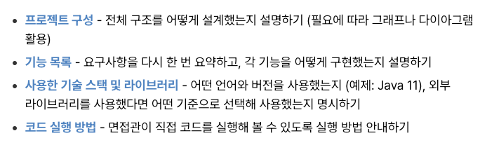
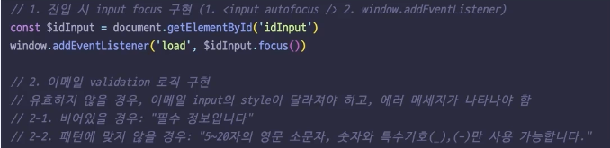
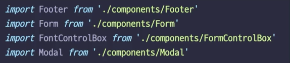
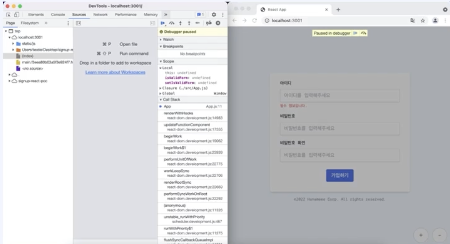

## 사전과제

#### 요구사항

**문제 해결 능력**

- 확장성 있고 유지보수가 용이한가?
- 이해하기 쉬운 코드인가?
- 일관성 있게 작성된 코드인가?
- 효율성이 좋은 코드인가?

**협업 능력**

- 변수 네이밍이 일관성 있고 정보를 잘 전달하느가?
- 적절한 도구(prettier, eslint) 를 활용하여 코딩 컨벤션을 준수했는가?
- 모듈화가 잘 되어 있는 파악하기 쉬운 코드인가?
- [README.md](http://readme.md/) 작성을 하였는가?
- git commit를 나눠서 했는가?
  

**기술적 역량**

- 적절한 문법을 사용해 구현했는가?
- 테스트를 작성했는가? 테스트에서 에지 케이스(edge case)까지 커버했는가?
- 에러 처리에 대한 고려가 되어 있는가?
- 성능 최적화가 되어 있는가?

#### 팁

1. 의사코드 혹은 주석, 손그림 등으로 코드 흐름을 미리 생각해보고 구현하기

2. 최대한 많은 문제를 정확하지 않게 구현하는 것보다 < 아는 문제들을 정확하고 완벽하게 구현하는 것

3. 코드 가독성과 재사용성을 고려하자.

4. 개발자 도구를 활용한 디버깅

